# stream_viz : A stream analysis & visualization tool

Welcome to **stream_viz**, our comprehensive data analysis and drift detection package!
This library is designed to provide robust tools for encoding data, detecting various types of drifts,
visualizing feature changes over time, and handling missing data with advanced visualization techniques.
Whether you're dealing with normal data, data with missing values, or strategy data, our package has
specialized encoders and detectors to meet your needs.

## Links
- #### [Readme of our package (contains implementations details)](stream_viz/README.md)
- #### [User Guide](stream_viz/tutorial/UserGuide.ipynb)
- #### [Project Report](academic_files/stream_viz_Report.pdf)
- #### [Project Presentation](academic_files/stream_viz_presentation.pdf)

## Key Features

### Data Encoding
- **Efficient and Flexible**: Mechanisms for encoding various data types.
- **Specialized Encoders**:
  - `NormalDataEncoder`: For normal data without missing values.
  - `MissingDataEncoder`: For normal data with missing values.
  - `KappaStrategyDataEncoder`: For strategy data without missing values.

### Drift Detection
- **Real Concept Drift**: Algorithms for detecting changes in the conditional probability distribution $p(y|X)$.
  - **McDiarmid Drift Detection Method (MDDM)**: Uses a sliding window approach with arithmetic, geometric, and Euler weighting schemes.
- **Feature Drift**: Detection using the Kolmogorov-Smirnov (KS) test and Population Stability Index (PSI) test.

### Visualization
- **Feature Changes Over Time**: Advanced techniques for analyzing feature changes.
- **Data Velocity**: Visualization of the velocity of the stream.
- **Missingness Patterns**: Techniques for visualizing missing data.
- **Learning Strategies**: Compare performance metrics of different learning strategies over the course of the stream.

## Goals
- **Research Stream Visualization Methods**: Explore various methods for visualizing streaming data.
- **Implement Drift Detection**: At least one method for concept drift detection.
- **Visualize Drift**: Visualizations for both concept and feature drift.
- **Visualize Data Velocity**: Techniques for visualizing the velocity of the stream.
- **Visualize Missing Values**: Explore ways to visualize missing values.
- **Compare Learning Strategies**: Visualizations to compare performance metrics of different learning strategies.

## Achieved By
- **Integrating Implementations**: All of the above implementations are integrated into a
- Python package in an object-oriented way.

## Usage

For detailed explanations or implementation details, please refer to our [User Guide](stream_viz/tutorial/UserGuide.ipynb)
in jupyter notebook format or you can check out the [pdf](stream_viz/tutorial/UserGuide.pdf) too.

Please check the [readme](stream_viz/README.md) of our package to understand the implementation details for it.

## Installation

To get started with stream-viz, follow these installation instructions:

1. **Create a new Conda environment** with Python version between 3.8.0 and 3.10.0:
    ```sh
    conda create --name your_env_name python=3.9
    ```
    Alternatively, ensure your machine has a compatible Python version within this range.

2. **Clone the repository**:
    ```sh
    git clone https://github.com/aditya0by0/stream-viz.git
    ```

3. **Navigate to the package directory and install the package**:
    ```sh
    cd stream-viz
    pip install .
    ```

## Example

Here’s a brief example to get you started:

```python
from stream_viz import NormalDataEncoder, RealConceptDriftDetector, DataStreamer

# Encode data
encoder = NormalDataEncoder()
encoder.read_csv_data('path/to/your/data.csv')
encoder.encode_data()

# Detect drift
drift_detector = RealConceptDriftDetector()
streamer = DataStreamer(drift_detector)
streamer.stream_data(encoder.X_encoded_data, encoder.y_encoded_data)

# Visualize results
drift_detector.plot()
```

For more detailed usage examples, please refer to the [User Guide](stream_viz/tutorial/UserGuide.ipynb).

## Contributing

We welcome contributions! Please see our [Contributing Guide](#) for more details.

## License

This project is licensed under the MIT License. See the [LICENSE](LICENSE) file for details.

---

**stream_viz**: Advanced data analysis and drift detection made easy. Happy analyzing!

---

This package provides all the tools you need to effectively encode, detect drifts, and visualize streaming data, ensuring that your models remain robust and your insights stay accurate.

---

# Few Examples with Visualizations

## Data Encoder Implementations

```python
from stream_viz.data_encoders.cfpdss_data_encoder import NormalDataEncoder
from stream_viz.utils.constants import _NORMAL_DATA_PATH  # Variable only for developers

normal_encoder = NormalDataEncoder()
# Here, add path to your file, the below variable is for internal use only.
# Add relevant/neccessary parameters supported by pandas.read_csv, if required
normal_encoder.read_csv_data(filepath_or_buffer=_NORMAL_DATA_PATH)
normal_encoder.encode_data()
normal_encoder.X_encoded_data.head()
```


<div>

<table border="1" class="dataframe">
  <thead>
    <tr style="text-align: right;">
      <th></th>
      <th>c5_b</th>
      <th>c6_b</th>
      <th>c7_b</th>
      <th>c8_b</th>
      <th>c9_b</th>
      <th>n0</th>
      <th>n1</th>
      <th>n2</th>
      <th>n3</th>
      <th>n4</th>
    </tr>
  </thead>
  <tbody>
    <tr>
      <th>0</th>
      <td>0</td>
      <td>0</td>
      <td>1</td>
      <td>0</td>
      <td>0</td>
      <td>0.528245</td>
      <td>0.598345</td>
      <td>0.558432</td>
      <td>0.482846</td>
      <td>0.612024</td>
    </tr>
    <tr>
      <th>1</th>
      <td>0</td>
      <td>0</td>
      <td>0</td>
      <td>1</td>
      <td>1</td>
      <td>0.662432</td>
      <td>0.423329</td>
      <td>0.487623</td>
      <td>0.454495</td>
      <td>0.452664</td>
    </tr>
    <tr>
      <th>2</th>
      <td>0</td>
      <td>0</td>
      <td>0</td>
      <td>1</td>
      <td>1</td>
      <td>0.562990</td>
      <td>0.576429</td>
      <td>0.545916</td>
      <td>0.370166</td>
      <td>0.543403</td>
    </tr>
    <tr>
      <th>3</th>
      <td>0</td>
      <td>0</td>
      <td>0</td>
      <td>1</td>
      <td>1</td>
      <td>0.475311</td>
      <td>0.566046</td>
      <td>0.539992</td>
      <td>0.421434</td>
      <td>0.544852</td>
    </tr>
    <tr>
      <th>4</th>
      <td>1</td>
      <td>0</td>
      <td>0</td>
      <td>1</td>
      <td>0</td>
      <td>0.370579</td>
      <td>0.554642</td>
      <td>0.536804</td>
      <td>0.223743</td>
      <td>0.392332</td>
    </tr>
  </tbody>
</table>
</div>


```python
from stream_viz.data_encoders.cfpdss_data_encoder import MissingDataEncoder
from stream_viz.utils.constants import (
    _MISSING_DATA_PATH,
)  # Variable only for developers

missing_encoder = MissingDataEncoder()
missing_encoder.read_csv_data(
    filepath_or_buffer=_MISSING_DATA_PATH,  # Here, add path to your file, this variable is for internal use only.
    index_col=[
        0
    ],  # Add relevant/neccessary parameters supported by pandas.read_csv, if required
)
missing_encoder.encode_data()
missing_encoder.X_encoded_data.head()
```


<div>

<table border="1" class="dataframe">
  <thead>
    <tr style="text-align: right;">
      <th></th>
      <th>c5_b</th>
      <th>c6_b</th>
      <th>c7_b</th>
      <th>c8_b</th>
      <th>c9_b</th>
      <th>n0</th>
      <th>n1</th>
      <th>n2</th>
      <th>n3</th>
      <th>n4</th>
    </tr>
  </thead>
  <tbody>
    <tr>
      <th>0</th>
      <td>0.0</td>
      <td>0.0</td>
      <td>1.0</td>
      <td>0.0</td>
      <td>0.0</td>
      <td>0.530356</td>
      <td>0.598345</td>
      <td>0.519161</td>
      <td>0.478557</td>
      <td>0.620371</td>
    </tr>
    <tr>
      <th>1</th>
      <td>0.0</td>
      <td>0.0</td>
      <td>0.0</td>
      <td>1.0</td>
      <td>1.0</td>
      <td>0.672618</td>
      <td>0.423329</td>
      <td>0.442055</td>
      <td>0.449888</td>
      <td>0.458838</td>
    </tr>
    <tr>
      <th>2</th>
      <td>0.0</td>
      <td>0.0</td>
      <td>0.0</td>
      <td>1.0</td>
      <td>1.0</td>
      <td>0.567192</td>
      <td>0.576429</td>
      <td>0.505532</td>
      <td>0.364614</td>
      <td>0.550814</td>
    </tr>
    <tr>
      <th>3</th>
      <td>0.0</td>
      <td>0.0</td>
      <td>0.0</td>
      <td>1.0</td>
      <td>1.0</td>
      <td>0.474236</td>
      <td>0.566046</td>
      <td>0.499081</td>
      <td>0.416457</td>
      <td>0.552283</td>
    </tr>
    <tr>
      <th>4</th>
      <td>1.0</td>
      <td>0.0</td>
      <td>0.0</td>
      <td>1.0</td>
      <td>0.0</td>
      <td>0.363202</td>
      <td>0.554642</td>
      <td>0.495610</td>
      <td>0.216550</td>
      <td>0.397683</td>
    </tr>
  </tbody>
</table>
</div>


```python
from stream_viz.data_encoders.strategy_data_encoder import KappaStrategyDataEncoder
from stream_viz.utils.constants import (
    _LEARNING_STRATEGY_DATA_PATH,
)  # Variable only for developers

kappa_encoder = KappaStrategyDataEncoder()
kappa_encoder.read_csv_data(
    filepath_or_buffer=_LEARNING_STRATEGY_DATA_PATH,  # Here, add path to your file, this variable is for internal use only.
    header=[
        0,
        1,
        2,
    ],  # Add relevant/neccessary parameters supported by pandas.read_csv, if required
    index_col=[0, 1],
)
kappa_encoder.encode_data()
kappa_encoder.encoded_data.head()
```


<div>

<table border="1" class="dataframe">
  <thead>
    <tr style="text-align: right;">
      <th></th>
      <th>model_all</th>
      <th>model_optimal</th>
      <th>model_label</th>
      <th>model_feat</th>
      <th>model_nafa</th>
      <th>model_smraed_catc</th>
      <th>model_smraed_sumc</th>
      <th>model_smraed_prioc</th>
      <th>model_smraed_</th>
    </tr>
    <tr>
      <th>Batch_Start</th>
      <th></th>
      <th></th>
      <th></th>
      <th></th>
      <th></th>
      <th></th>
      <th></th>
      <th></th>
      <th></th>
    </tr>
  </thead>
  <tbody>
    <tr>
      <th>50</th>
      <td>0.593128</td>
      <td>0.593128</td>
      <td>0.432892</td>
      <td>0.593128</td>
      <td>0.432892</td>
      <td>0.257426</td>
      <td>0.257426</td>
      <td>0.432892</td>
      <td>0.593128</td>
    </tr>
    <tr>
      <th>100</th>
      <td>0.447950</td>
      <td>0.409449</td>
      <td>0.294671</td>
      <td>0.332810</td>
      <td>0.296875</td>
      <td>0.334898</td>
      <td>0.296875</td>
      <td>0.221184</td>
      <td>0.334898</td>
    </tr>
    <tr>
      <th>150</th>
      <td>0.838710</td>
      <td>0.919614</td>
      <td>0.388254</td>
      <td>0.676375</td>
      <td>0.384236</td>
      <td>0.592834</td>
      <td>0.634146</td>
      <td>0.592834</td>
      <td>0.426230</td>
    </tr>
    <tr>
      <th>200</th>
      <td>0.880000</td>
      <td>0.840000</td>
      <td>0.720000</td>
      <td>0.760000</td>
      <td>0.360000</td>
      <td>0.680000</td>
      <td>0.680000</td>
      <td>0.680000</td>
      <td>0.520000</td>
    </tr>
    <tr>
      <th>250</th>
      <td>0.918831</td>
      <td>0.959612</td>
      <td>0.720000</td>
      <td>0.708819</td>
      <td>0.295775</td>
      <td>0.672131</td>
      <td>0.708819</td>
      <td>0.672131</td>
      <td>0.573379</td>
    </tr>
  </tbody>
</table>
</div>


---


## 1.  Real Concept Drift


```python
# --------------- Real Concept Drift --------------------------------------------------
from stream_viz.data_streamer import DataStreamer
from stream_viz.real_drift.r_drift_detector import RealConceptDriftDetector

# Initialize DataStreamer with drift detectors
dt_streamer = DataStreamer(
    rcd_detector_obj=RealConceptDriftDetector(),
)

# Stream data and apply drift detection
dt_streamer.stream_data(
    X_df=missing_encoder.X_encoded_data, y_df=missing_encoder.y_encoded_data
)

# Plot results
dt_streamer.rcd_detector_obj.plot(start_tpt=100, end_tpt=3000)
```


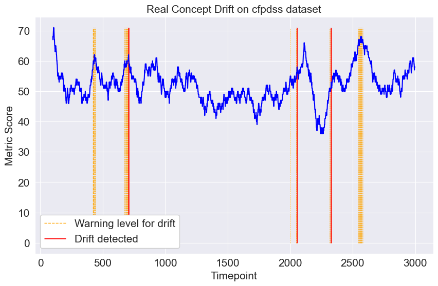


---

## 2. Feature Drift Detection


```python
from stream_viz.data_streamer import DataStreamer
from stream_viz.feature_drift.f_drift_detector import FeatureDriftDetector

dt_streamer = DataStreamer(
    fd_detector_obj=FeatureDriftDetector(data_encoder=normal_encoder)
)
dt_streamer.stream_data(
    X_df=normal_encoder.X_encoded_data, y_df=normal_encoder.y_encoded_data
)
```


```python
dt_streamer.fd_detector_obj.plot(feature_name="n0")
```


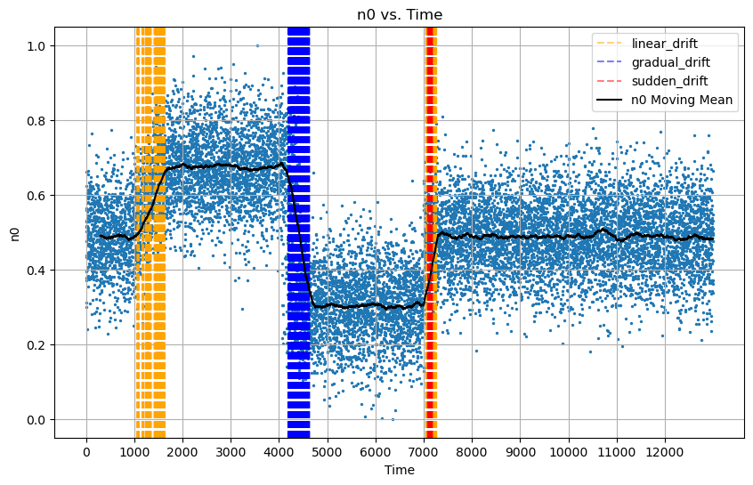


```python
dt_streamer.fd_detector_obj.plot(feature_name="c5")
```


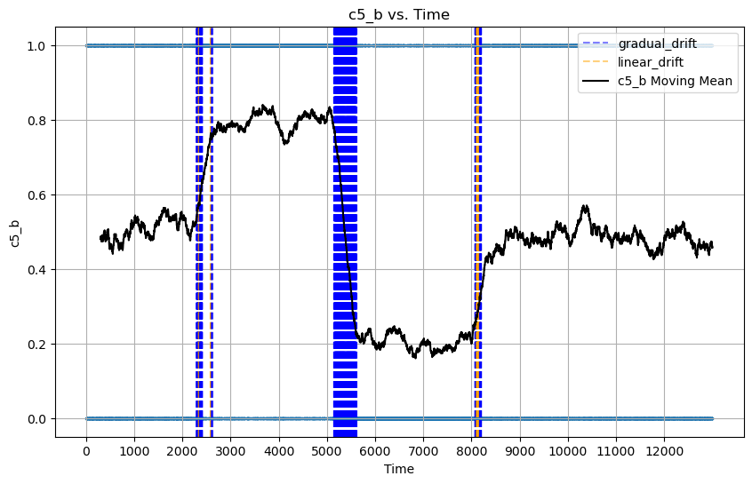


## 3. Velocity Plots


```python
from stream_viz.velocity.velocity_charts import FeatureVelocity

feature_vel = FeatureVelocity(missing_encoder)
# Plot categorical feature
feature_vel.plot(
    features="c5", chunk_size=100, start_period=10, end_period=35, x_label_every=5
)
```


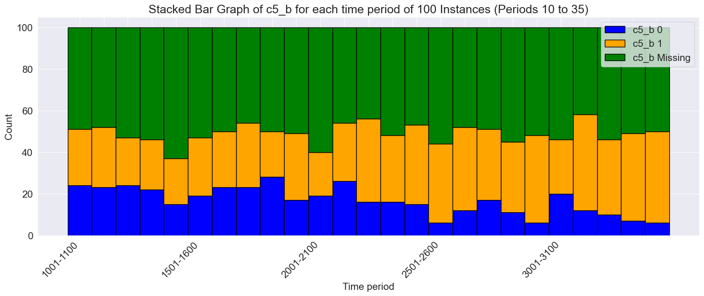


```python
from stream_viz.velocity.velocity_charts import FeatureVelocity

feature_vel = FeatureVelocity(missing_encoder)
# Plott numerical features
feature_vel.plot(features=["n0", "n1"], window_size=10, start_tp=200, end_tp=500)
```


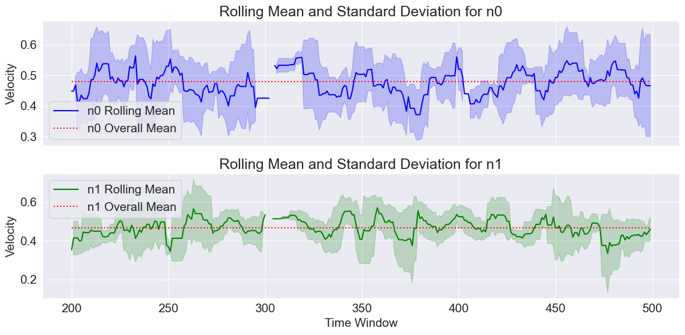


### Stream Graphs


```python
from stream_viz.velocity.velocity_charts import StreamGraph

streamgraph = StreamGraph(normal_encoder)
streamgraph.plot("c5_b")
```


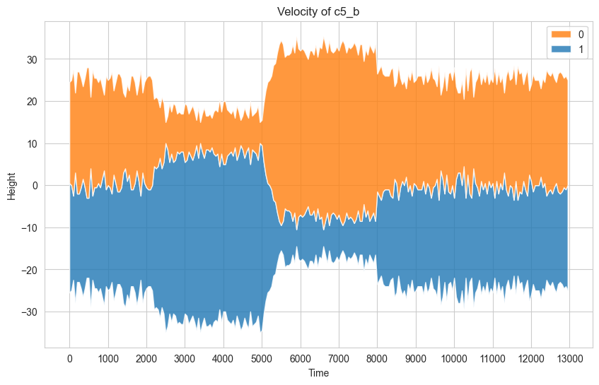


## 4. Missingness Plots


```python
from stream_viz.data_missingness.missingness import HeatmapPlotter

plotter = HeatmapPlotter(missing_encoder.X_encoded_data)
plotter.display()
```


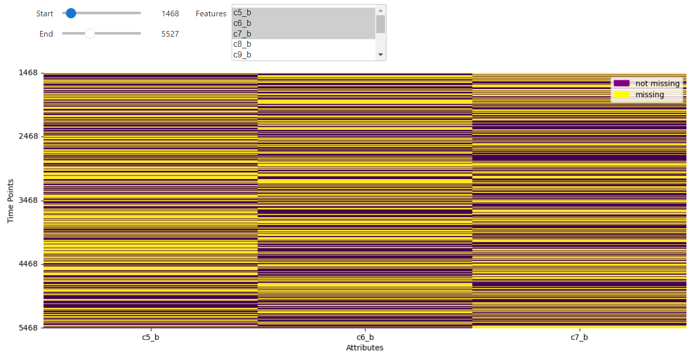


```python
from stream_viz.data_missingness.missingness import StackedBarGraph

# Create the StackedBarGraph object and plot it
stacked_bar = StackedBarGraph(missing_encoder)
stacked_bar.plot("c5_b", 1000)
```


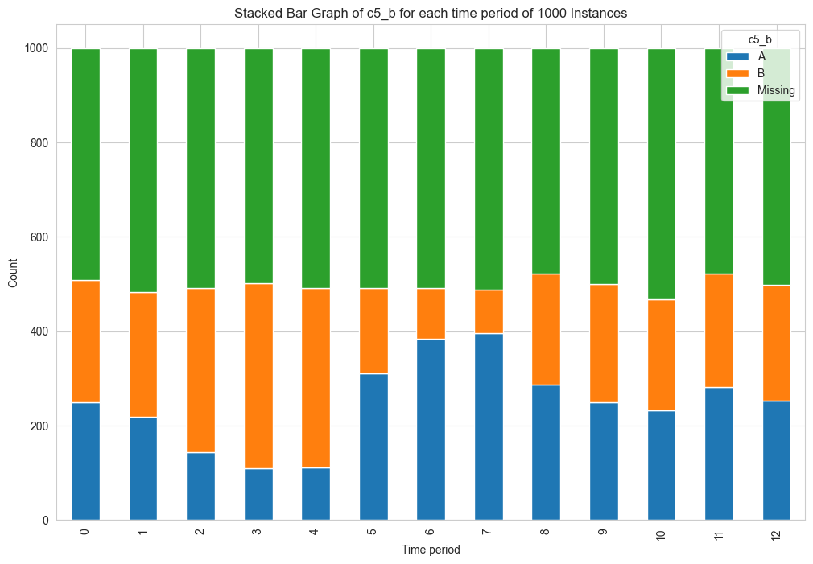


### Scatter Plot

```python
from stream_viz.data_missingness.missingness import ScatterPlotter

scatter_plotter = ScatterPlotter(normal_encoder, missing_encoder)
scatter_plotter.plot_numerical("n0")
```


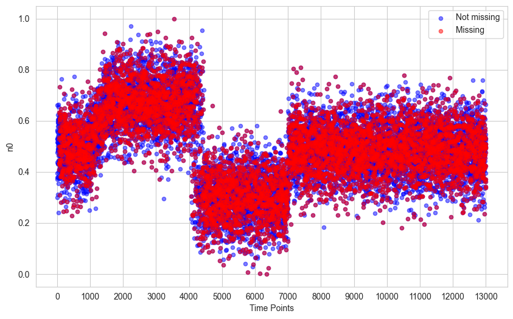


```python
scatter_plotter.plot_categorical("c5_b")
```


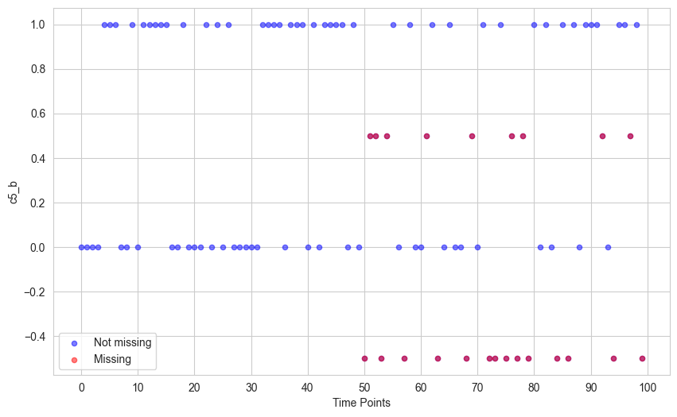


### Data Missingness HeatMap Plot (Additional/Optional)


```python
from stream_viz.data_missingness.missingness import MarHeatMap

mar_hm = MarHeatMap(
    normal_encoder_obj=normal_encoder, missing_encoder_obj=missing_encoder
)
mar_hm.plot(start_tpt=0, end_tpt=1299, significance_level=0.05)
```


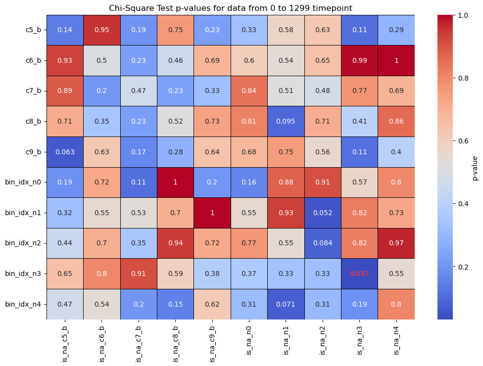


---

## 5. Learning Strategies Plot

### Strategy Plot

A basic plot:

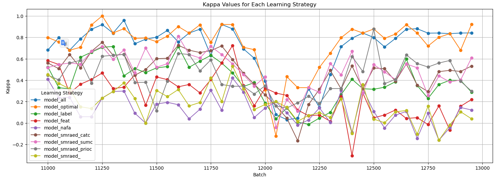

```python
from stream_viz.learning_strategies.strategy_viz import LearningStrategyChart

# Create the learning strategy chart and plot it
LearningStrategyChart(kappa_encoder.encoded_data).plot(start_tpt=11000, end_tpt=12950)
```


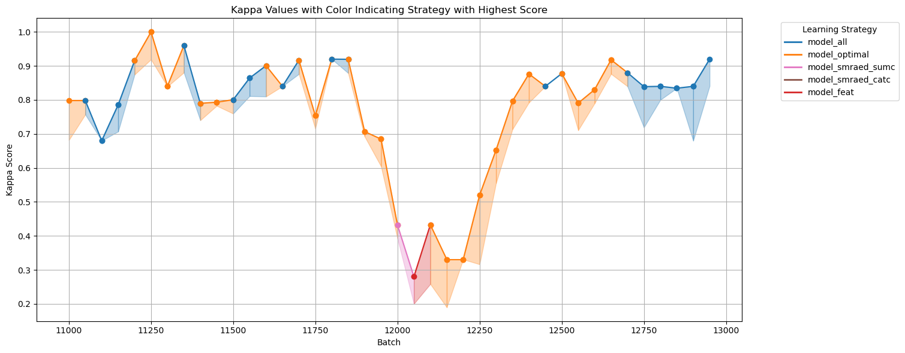
